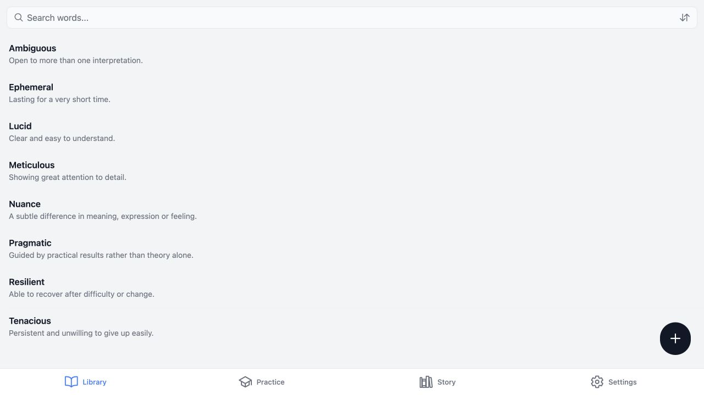
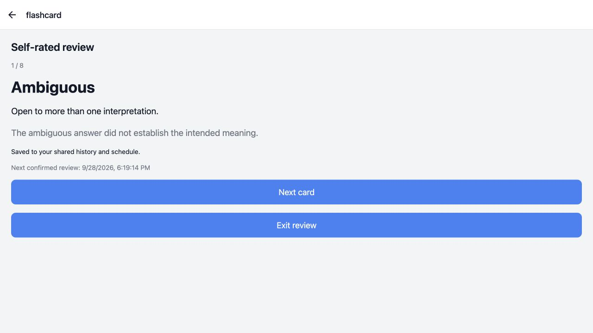
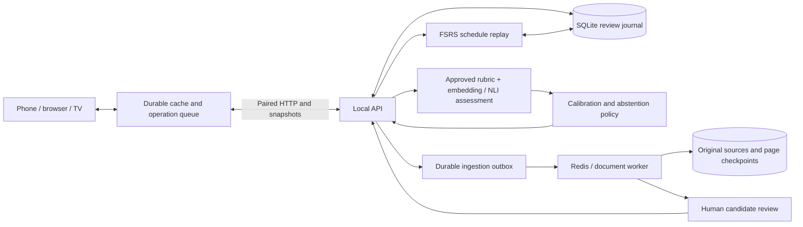

# RecallX

A vocabulary learning app with a shared review history, offline recovery, source-aware document ingestion and evidence-gated semantic assessment.

[](https://github.com/sethanimesh/recallX/actions/workflows/ci.yml)

RecallX connects a phone, browser and Android TV to one locally hosted learner library. The backend owns review history and FSRS scheduling; clients keep a durable cache and retry saved operations after reconnecting. Imported words retain their source passages, and generated content requires human review.

**Current status:** self-rated flashcard reviews are usable. Semantic grading is experimental: the recorded evaluation passes no language release gate, so it abstains and leaves the schedule unchanged. No improvement in real learners’ retention is claimed.

## Why this project exists

Collecting vocabulary from PDFs, images and reading notes creates two linked problems: preserving the meaning and source of a word, and recording what was actually recalled across devices. A word list alone supplies neither a reliable review history nor a defensible correctness decision. Independently scheduled clients also have to reconcile retries, lost acknowledgements and edits to the meaning being tested.

RecallX treats learning history as a persistent journal. It uses versioned content, immutable review IDs and server-confirmed schedules, while separating generated teaching material from assessment evidence. The difficult parts are durable offline writes, recoverable document jobs, ambiguous multilingual answers and coordinating local models within a single machine’s memory budget.

## Try it

The sample-data demo needs **Python 3.11 and Node.js 22**. It does not require API keys, Redis or model checkpoints.

```sh
git clone https://github.com/sethanimesh/recallX.git
cd recallX
python3.11 -m venv backend/.venv
backend/.venv/bin/python -m pip install -r backend/requirements.lock.txt
npm ci
npm run export:web
backend/.venv/bin/python scripts/demo.py
```

Open the printed browser URL. In **Settings → Connection and sync**, enter the printed API URL and temporary bootstrap secret, then select **Pair first device**. The demo seeds eight constructed vocabulary items in a fresh temporary database. Select **Practice → Start Review → Self-rated flashcards**, attempt recall, reveal the meaning, and choose Again or Good.

See the [demo walkthrough](docs/demo.md) for screenshots and expected behavior. The [full setup guide](docs/setup.md) covers persistent data, phone/TV pairing, optional drafting providers, document workers, local model environments and backup/restore.

## Demo



*The browser library after pairing and sync. The eight items are constructed demo fixtures; no personal vocabulary or learning history is shown.*



*A revealed flashcard after a self-rating. The acknowledgement and due date come from the backend, showing the review path that remains available when semantic grading abstains.*

## Architecture



| Choice | Reason | Cost |
| --- | --- | --- |
| Central review journal and FSRS authority | One acknowledged schedule across devices; UUID retries retain the original receipt | Offline reviews wait for server acknowledgement |
| Embedding/NLI evidence with abstention | Separate semantic support, contradiction and uncertainty from content generation | Model and calibration requirements; current language gates fail |
| Database-backed document jobs and page checkpoints | Recover work after broker or worker failure; retain source provenance | More state and recovery logic than a synchronous upload |
| Separate local inference environments and a shared lease | Coordinate incompatible runtimes and heavy model residency | Cold starts and waiting for active OCR pages |

The [architecture](docs/architecture.md) explains responsibilities, state and interaction flow. Four [decision records](docs/adr/README.md) describe alternatives and trade-offs as retrospective records of the current implementation.

## Evaluation

The evidence separates controlled tests, execution with real model checkpoints, synthetic experiments and real learner outcomes.

| Check or experiment | Recorded result | What it establishes |
| --- | --- | --- |
| Backend regression suite | 222 passed, 1 opt-in model test skipped | Tested storage, pairing, retry, review and job invariants |
| Client regression suite | 51 suites / 335 tests passed; type checking passed | Tested client logic, durable browser storage and recovery behavior |
| Migration rehearsal | 458 existing item IDs preserved through nine migrations | Compatibility for the recorded database fixture |
| Semantic grading | 4,800 constructed examples; English accepted 286/320 held-out answers with 95.10% accepted precision | Actual checkpoint behavior on synthetic labels |
| Grading release gate | English noise degradation: 11.28 percentage points against a 5-point limit; Hindi/Hinglish coverage: 0% | No language is enabled by the recorded artifact |
| OCR compatibility fixture | Two English sentences recognized exactly; 22.72 seconds including startup/queue time | One full CPU-layout/MLX recognition check |
| FSRS fitting demonstration | Synthetic reporting log loss: 0.266717 → 0.234112 | Optimizer mechanics on simulated outcomes; no learner benefit established |

The embedding/NLI hybrid did **not** beat every baseline: NLI-only unselective macro-F1 was higher on the recorded English and Hindi test partitions. The project reports that negative result instead of treating the hybrid design as demonstrated superiority.

Read the [evaluation protocol and baselines](docs/evaluation.md), [failure analysis](docs/failure-analysis.md), [limitations](docs/limitations.md) and [raw result navigation](evaluation/README.md). These measurements are narrow experiments, not production traffic or prospective learner studies.

## Verify and reproduce

```sh
bash scripts/verify.sh
```

This runs isolated backend tests, generated-contract checks, client type checking, client tests, the offline-cache harness and a browser export. CI runs these checks without private keys or downloaded model weights. The opt-in model test and native platform builds require their separate environments.

The [evaluation guide](evaluation/README.md) distinguishes reproducing summaries from stored inference records and rerunning the actual models. Fresh experimental output belongs under ignored `evaluation/local/` so preserved result artifacts are not overwritten.

## Implementation and history

Project-specific code implements the client workflows, durable sync/review envelopes, content and rubric versioning, source/job recovery, assessment policy and evaluation harness. FSRS scheduling/optimization, model checkpoints, OCR and application frameworks come from upstream projects; this repository does not claim to introduce those algorithms or train those models.

The Git history records the January–July 2026 development work and later implementation and evaluation changes. Its first recorded commit is **7 January 2026**. Commit history and documented observations are kept separate.

The main finding is that a high aggregate score is insufficient for a multilingual correctness decision: noise sensitivity and language-specific coverage can still fail the release criteria. The next questions are whether independently annotated learner answers support a useful operating point, how OCR behaves on varied source documents, and whether prospective personal history supports better scheduling.

## Repository map

| Path | Contents |
| --- | --- |
| [app/](app/) and [src/](src/) | Expo routes, clients, storage, queues and regression tests |
| [backend/](backend/) | API, migrations, scheduling, ingestion and assessment workers |
| [docs/](docs/) | Setup, architecture, decisions, methodology, evaluation and limitations |
| [evaluation/](evaluation/) | Constructed datasets, experiment scripts and frozen grading results |
| [examples/](examples/) | Public sample vocabulary for the isolated demo |
| [.github/](.github/) | Automated checks and contribution templates |

See [CONTRIBUTING.md](CONTRIBUTING.md) for the development workflow. Local databases, source assets, credentials, generated builds and private notes are excluded from the published file tree. Licensing has not yet been selected; upstream dependencies retain their respective licenses.
