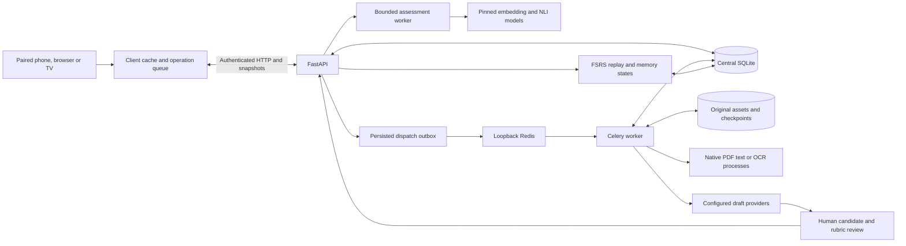
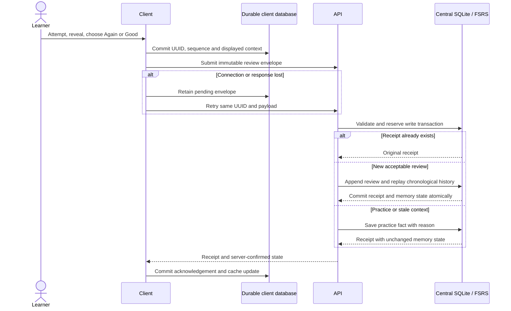
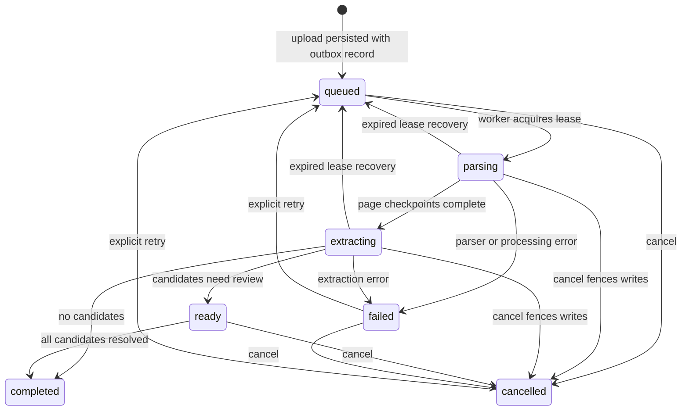

# Architecture

Documented 28 September 2026 from the current implementation. RecallX is a single-learner application: paired phone, browser and Android TV clients share a vocabulary library and review history through a locally hosted API. The server computes due dates; clients store a durable cache and pending operations.

## System boundary

The local API, database, asset directory and owned worker processes belong to the deployment. Downloaded model checkpoints and optional hosted generation providers are dependencies. Generation supplies editable content; the assessment worker alone supplies semantic evidence, and server review policy decides whether an attempt can change memory state.

The supervisor starts Redis on loopback port 6380, a single Celery worker, API port 8000 and optional static web host port 8082. Phones and TV reach the API over the local network. This is a personal Mac deployment; the repository does not establish a public, multi-tenant service.

## Responsibilities and state

| Component | Responsibility | Durable state / output |
| --- | --- | --- |
| Expo clients | Library, source review, pairing, recall, self-rating and export interfaces | Cached snapshots, answer drafts and immutable operation envelopes |
| API and pairing | Authenticate revocable devices; validate canonical content and revisions | Operation receipts, device identities and versioned settings |
| Central SQLite | Preserve review facts and source relationships in transactions | Items/senses, rubrics, assessments, reviews, corrections, jobs and parameter versions |
| Scheduling service | Replay acknowledged reviews through pinned Python FSRS | Separate recall and flashcard memory states per item |
| Assessment worker | Compare answer spans with approved concepts using embeddings and NLI | Per-concept support/contradiction evidence and a calibrated selective decision |
| Ingestion worker | Parse pages, draft candidates and resume checkpoints | Pages, reading order, geometry, candidate drafts and passage citations |
| Optimisation worker | Fit eligible history and compare a frozen candidate prospectively | Training snapshots, validation/reporting windows and activation records |

Native clients use Expo SQLite. The browser runs SQL.js and commits exported database bytes to IndexedDB; Web Locks coordinate tabs. A failed durable write restores the last snapshot. The bundled service worker caches the exported application shell while excluding API and authenticated requests. Offline availability therefore requires a previously loaded export, successful storage initialization and a synced library.

## Review acknowledgement

An offline self-rating displays **schedule pending** until acknowledged. Typed answers remain drafts while assessment is unavailable. Reusing a UUID with different content is a conflict. Distinct concurrent reviews are retained and replayed in `(answered_at, device_id, device_sequence, id)` order; a stale expected state version produces a reconciliation flag rather than dropping an otherwise valid attempt.

Content revisions, rubric revisions, settings revisions, parameter versions and reset generations have different purposes. They prevent an answer about an old meaning or an old progress generation from changing the current schedule while retaining the attempt for inspection. Corrections append records and trigger replay. Reset advances the generation; it does not erase historical facts.

## Assessment pipeline

An assessment request carries an item ID, content revision, attempt UUID, answer and language. The server loads the approved rubric. Qwen3-Embedding-0.6B aligns answer spans with each concept; mDeBERTa scores entailment, neutrality and contradiction for all spans. Required-concept coverage, weakest required support, contradiction, alignment and neutrality form the five scoring features.

A versioned calibration artifact supplies coefficients, temperature, language thresholds and contradiction vetoes. Model/device drift, missing rubrics, unavailable models, unsupported language pairs or failed release gates produce `uncertain`. These outcomes cannot record forgetting. Tutor and assisted attempts remain practice. The recorded evaluation currently passes no language gate, so semantic assessment abstains in the documented configuration.

## Durable ingestion

Uploads preserve actual bytes, hashes and request IDs. Queue messages contain job IDs; SQLite and disk retain the work. The outbox recovers broker refusal, and lease tokens fence stale workers. Parsed pages and extraction chunks commit independently, so a retry can skip completed stages. A running OCR page may finish after cancellation, but its stale worker cannot commit later stage writes.

Suitable PDF pages use native text; scanned or complex pages use full PaddleOCR-VL layout and recognition. Source boxes use displayed PDF points or normalized original-image pixels. Crop coordinates map back to the original frame. Candidate citations identify passages, not exact word-level semantic alignment. Approval atomically creates or reuses an item sense, preserves source links, creates a draft rubric and initializes both scheduling identities. Rubric approval remains a separate human action.

## Runtime and recovery trade-offs

The API, PyTorch grader, PaddleOCR and MLX recognition use separate pinned environments. Heavy local inference shares a file lease; waiting graders take priority between background pages. Owned OCR services stop before the lease is released. This bounds concurrent model residency on the personal Mac, while cold starts and long OCR pages still add latency. It is a single-host coordination mechanism, not a distributed scheduler.

The database uses numbered checksum-checked migrations, write transactions, foreign keys and verified pre-migration backups. Recovery requires both a consistent SQLite backup and the source asset directory. A database-only export can reference assets but cannot recreate missing original files.

## Implementation map

| Concern | Source | Focused checks |
| --- | --- | --- |
| Review policy and replay | [reviews.py](../backend/routers/reviews.py), [scheduling.py](../backend/services/scheduling.py) | [Central reviews](../backend/tests/test_central_reviews.py) |
| Client durability | [central.ts](../src/db/operations/central.ts), [browser database](../src/db/client.web.ts) | [Queue checks](../src/db/operations/__tests__/central.test.ts), [browser persistence](../src/db/__tests__/webPersistence.test.ts) |
| Assessment and gates | [service.py](../backend/assessment/service.py), [inference.py](../backend/assessment/inference.py), [scoring.py](../backend/assessment/scoring.py) | [Assessment checks](../backend/tests/test_assessment.py) |
| Job recovery and parsing | [dispatch.py](../backend/ingestion/dispatch.py), [worker.py](../backend/ingestion/worker.py), [parser.py](../backend/ingestion/parser.py) | [Ingestion checks](../backend/tests/test_ingestion.py), real queue smoke |
| Inference ownership | [local_runtime.py](../backend/local_runtime.py), [mlx_service.py](../backend/ingestion/mlx_service.py) | [Lease checks](../backend/tests/test_inference_lease.py), [service teardown](../backend/tests/test_mlx_service.py) |

The [decision records](adr/README.md) explain alternatives and consequences. The [methodology](methodology.md) describes how the implementation and evidence are assessed.
